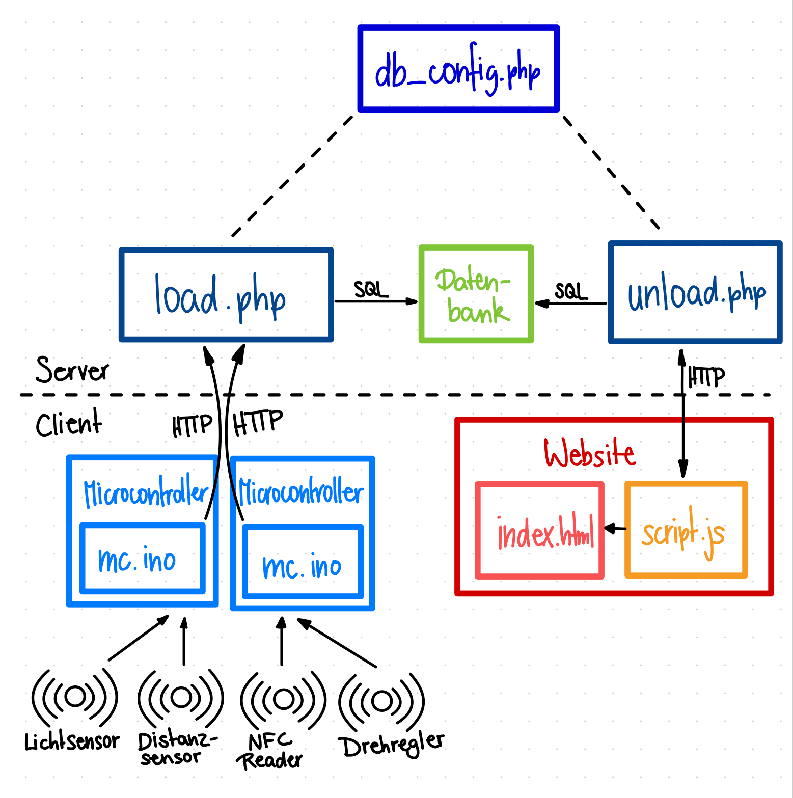

NFC: ID Wert
licht: 0=Hell 1=dunkel
distanz: Zahl
rotary: Zahl

# PROJEKT DOKUMENTATION - SCHACHMATT

## Inhaltsverzeichnis

1. [Projektbeschreibung](#Projektbeschreibung)
2. [Hardware-Setup und Code](#hardware-setup-und-Code)
3. [Kapitel 0](#Kapitel)
4. [Kapitel 1](#Kapitel-1)  
5. [Kapitel 2](#Kapitel-2)  
6. [Kapitel 3](#Kapitel-3)  

## Projektbeschreibung

In diesem Projekt entwickeln wir einen Geocache unter dem Motto Schachpartie, der sowohl physische als auch digitale Elemente miteinander verbindet. Der Cache wird zunächst über einen QR-Code aktiviert, den die Finder vor Ort scannen. Dieser führt auf eine Website, auf der vier interaktive Rätsel gelöst werden müssen. Jedes dieser Rätsel verlangt zum Abschluss eine konkrete Aktion auf einem physischen Schachbrett. Diese Aktionen werden mithilfe verschiedener Sensoren erfasst und in einer Datenbank gespeichert. Die gespeicherten Daten werden anschliessend ausgewertet, um die Korrektheit der Eingaben zu überprüfen. Der finale Cache öffnet sich nur dann, wenn alle Rätsel korrekt gelöst und alle zugehörigen physischen Eingaben richtig ausgeführt wurden.

## Hardware-Setup und Code

### Lichtsensor
Grundlagen des Lichtsensors...
Der Lichtsensor bereitete uns mehr Probleme wie wir ursprünglich gedacht hatten. Da wir unsere Sensoren unter einem Schachbrett verstecken, musste der Lichtsensor nochmal angepasst werden.

---

### Distanzsensor
Lorem Ipsum

---

### NFC Reader
Lorem Ipsum

---

### Drehregler

Funktionsweise:
1. Der Rotary Encoder wird via Interrupt abgefragt.
2. Die Bewegung wird als relative Position (von 0 bis `NUM_POSITIONS - 1`) interpretiert.
3. Nach einer kurzen Stabilitätsverzögerung (5 Sekunden ohne weitere Bewegung) wird die Position via HTTP POST als JSON an den Server gesendet.

Hardware-Setup

| Komponente       | Anschluss ESP32 |
|------------------|-----------------|
| Rotary Encoder A | GPIO 2 (ENC_A)  |
| Rotary Encoder B | GPIO 3 (ENC_B)  |

für im body vom index.html

